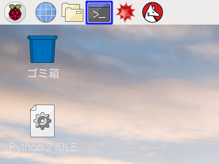

AIDOR ACCELERATION 基礎知識講座 第5回 | サンプルプログラム
===============================================================================

What's This?
-------------------------------------------------------------------------------

IoT・ロボットビジネス創出プログラム「[AIDOR ACCELERATION](https://teqs.jp/acceleration)」における、
2018年度 基礎知識講座 第5回で使用したサンプルプログラムです。


Getting Started
-------------------------------------------------------------------------------

第2回の[セットアップ手順](https://github.com/Guvalif/aidor-acceleration-02/blob/master/README.md)，
および第3回の[セットアップ手順](https://github.com/Guvalif/aidor-acceleration-03/blob/master/README.md)もあわせて行ってください。

Raspberry Piにログインした後、下記画像 青線部内のアイコンをクリックし**ターミナル**を開きます。



**ターミナル**上で、以下のコマンドを入力します：

```sh
sudo apt-get install nodejs npm
```

これにより、

- `nodejs`: Node.js ::= 汎用用途のJavaScript開発環境
- `npm`: npm ::= Node.js用のパッケージ管理ツール

以上2点がインストールされます。

次に、[ダウンロードリンク](https://github.com/Guvalif/aidor-acceleration-05/archive/master.zip)をクリックすることで、
プログラムを一式ダウンロードできます。(この時、ダウンロード先・解凍先は `/home/pi` に変更してください。)

**ターミナル**上で、以下のコマンドを入力します：

```sh
cd ~/aidor-acceleration-05
npm i
```

これにより、Node-REDを起動するために必要なファイルがインストールされます。


How to Use
-------------------------------------------------------------------------------

**ターミナル**上で、以下のコマンドを入力します：

```sh
cd ~/aidor-acceleration-05
npm start
```

その後、Webブラウザ上で `http://127.0.0.1:1880` へアクセスすることで、
Node-REDを使用することができます。


Copyright (c) 2018,
-------------------------------------------------------------------------------

- [PLEN Project Company Inc.](https://plen.jp)
- [Kazuyuki TAKASE](https://github.com/Guvalif)

This software is released under [the MIT License](http://opensource.org/licenses/mit-license.php).